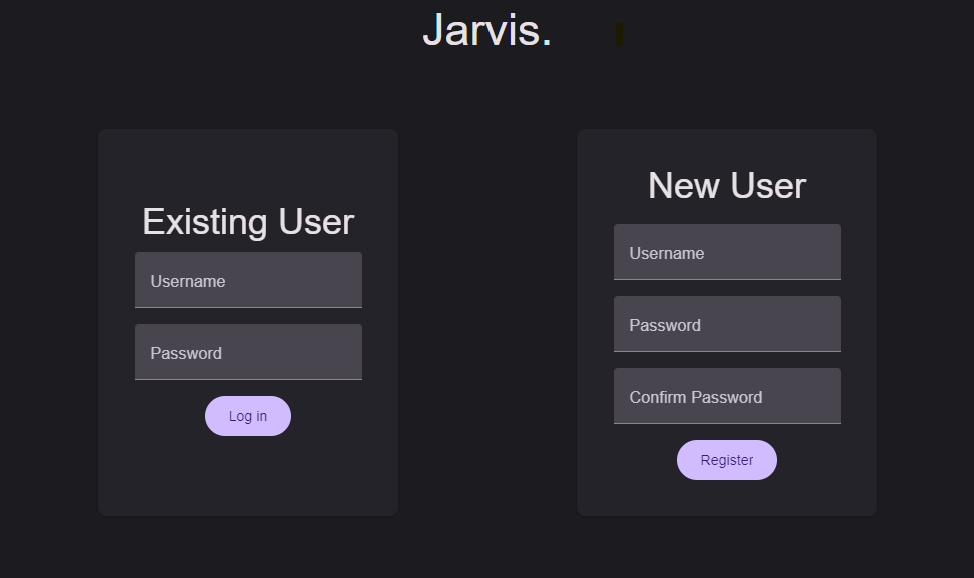
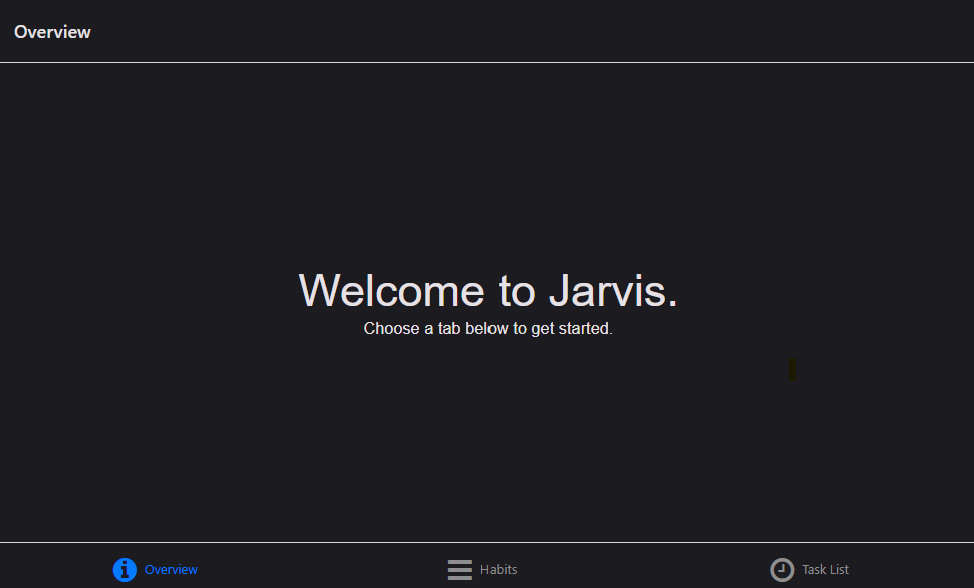
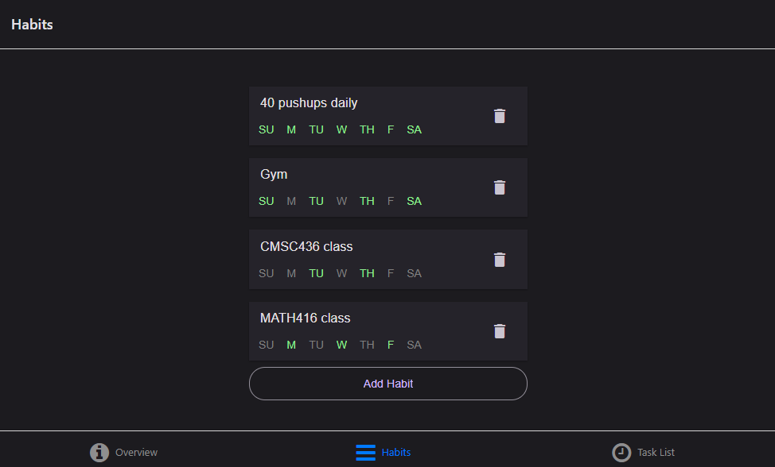
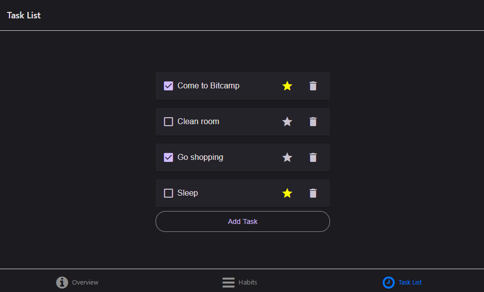

# Jarvis
A basic productivity web app with a fully featured REST API, featuring password encryption, secure token-based authentication, and a MongoDB database to store user data. The frontend is written in React Native, and the backend is written in Python using Flask.

## Security
Passwords are encrypted using [bcrypt](https://en.wikipedia.org/wiki/Bcrypt) with a random salt before being stored in Mongo, so that neither the application host nor any bad actor with access to the database can read user passwords.

Authorization tokens are generated with the cryptographically strong pseudo-random number generator provided in the [Python `secrets` module](https://peps.python.org/pep-0506/).

When a user logs in using their credientials, their password is checked against the hash stored in the database. If it matches, a new auth token is generated and returned to the user in plaintext. The token is then hashed using a fixed salt (provided in [config.py](backend/config.py) for the sake of this project, but would be injected via environment variables in a production environment) and inserted into the database. 

Each subsequent HTTP request from the user requires an `Authorization` header using the token provided during the login flow. The backend hashes the token and then searches the database for the hash. Since tokens are hashed using a fixed salt, any subsequent hashes of the same token will always be identical. This allows us to lookup users using a token as a primary key without storing the tokens in plaintext.

## Features
- Login/Register
- Dashboard
- Habit tracker
    - Add/delete habits
    - Mark off days each habit is completed
- Todo list
    - Add/delete tasks
    - Mark tasks as completed
    - Star tasks to set as high priority

## Running
Database: *MongoDB connection string* ([config.py](backend/config.py))

Backend:
```
cd backend
pip install -r requirements.txt
python app.py
```

Frontend:
```
cd frontend
npm i
npm start
```

## Screenshots
Login page:



Dashboard:



Habit tracker:



Todo list:



## Database schema
*Note: Yes, Mongo is a NoSQL database -- this SQL-style schema is just a tool for visualizing the data*

- Users

    | key | type |
    | ---: | :--- |
    | _id | ObjectId **[PRIMARY]** |
    | username | String  |
    | password | String *(hashed)* |

- Tokens
    
    | key | type |
    | ---: | :--- |
    | token | String *(hashed)* **[PRIMARY]** |
    | userID | ObjectId **[FOREIGN Users._id]** |

- Habits

    | key | type |
    | ---: | :--- |
    | _id | ObjectId **[PRIMARY]** |
    | _userID | ObjectId **[FOREIGN Users._id]** |
    | name | String |
    | scheduled | Boolean[7] |
    | completed | Boolean[7] |

- Tasks

    | key | type |
    | ---: | :--- |
    | _id | ObjectId **[PRIMARY]** |
    | _userID | ObjectId **[FOREIGN Users._id]** |
    | name | String |
    | completed | Boolean |
    | priority | Boolean |

## API contract
This contract is used as a reference both by the backend for how to implement the API, and by the frontend (and third-party clients) for how to consume it.

### Authorization
- **POST** /auth/register
    - Request
        - username: `String`
        - password: `String`
    - Response (username invalid)
        - Status code: **400 Bad Request**
        - error: `“Invalid username”`
    - Response (username conflict)
        - Status code: **409 Conflict**
        - error: `“Username already exists”`
    - Response (success)
        - Status code: **201 Created**
        - token: `String`
- **POST** /auth/login
    - Request
        - username: `String`
        - password: `String`
    - Response (username not found)
        - Status code: **404 Not Found**
        - error: `“Invalid username”`
    - Response (password incorrect)
        - Status code: **401 Unauthorized**
        - error: `“Incorrect password”`
    - Response (success)
        - Status code: **200 OK**
        - token: `String`
- **DELETE** /auth/delete
    - Request
        - username: `String`
        - password: `String`
    - Response (username not found)
        - Status code: **404 Not Found**
        - error: `“Invalid username”`
    - Response (password incorrect)
        - Status code: **401 Unauthorized**
        - error: `“Incorrect password”`
    - Response (success)
        - Status code: **200 OK**

### Habits
All requests must include `Authorization` header containing a valid token. All responses return **403** with error `“Invalid token”` if the provided token is not valid.

- **POST** /habits
    - Request
        - name: `String`
        - scheduled: `Bool[7]`
    - Response (success)
        - Status code: **201 Created**
        - habitID: `String` *(_id from database)*
        - name: `String`
        - scheduled: `Bool[7]`
        - completed: `Bool[7]`
- **GET** /habits
    - Response (success)
        - Status code: **200 OK**
        - habits: `[ ... ]` Array of Habit objects each containing:
            - habitID: `String` *(_id from database)*
            - name: `String`
            - scheduled: `Bool[7]`
            - completed: `Bool[7]`
- **PUT** /habits/:habitID
    - Request
        - name: `String`
        - scheduled: `Bool[7]`
        - completed: `Bool[7]`
    - Response (habitID not found)
        - Status code: **404 Not Found**
        - error: `“Habit not found”`
    - Response (success)
        - Status code: **200 OK**
        - name: `String`
        - scheduled: `Bool[7]`
        - completed: `Bool[7]`
- **DELETE** /habits/:habitID
    - Response (habitID not found)
        - Status code: **404 Not Found**
        - error: `“Habit not found”`
    - Response (success)
        - Status code: **200 OK**

### Tasks
All requests must include `Authorization` header containing a valid token. All responses return **403** with error `“Invalid token”` if the provided token is not valid.

- **POST** /tasks
    - Request
        - name: `String`
    - Response (success)
        - Status code: **201 Created**
        - taskID: `String` *(_id from database)*
        - name: `String`
        - completed: `Bool`
        - priority: `Bool`
- **GET** /tasks
    - Response (success)
        - Status code: **200 OK**
        - tasks: `[ ... ]` Array of Task objects each containing:
            - taskID: `String` *(_id from database)*
            - name: `String`
            - completed: `Bool`
            - priority: `Bool`
- **GET** /tasks/priority
    - Response (success)
        - Status code: **200 OK**
        - tasks: `[ ... ]` Array of Task objects each containing:
        - taskID: `String (_id from mongo)`
        - name: `String`
        - completed: `Bool`
        - priority: `true`
- **PUT** /tasks/:taskID
    - Request
        - name: `String`
        - completed: `Bool`
        - priority: `Bool`
    - Response (taskID not found)
        - Status code: **404 Not Found**
        - error: `“Task not found”`
    - Response (success)
        - Status code: **200 OK**
        - name: `String`
        - completed: `Bool`
        - priority: `Bool`
- **DELETE** /tasks/:taskID
    - Response (taskID not found)
        - Status code: **404 Not Found**
        - error: `“Task not found”`
    - Response (success)
        - Status code: **200 OK**
